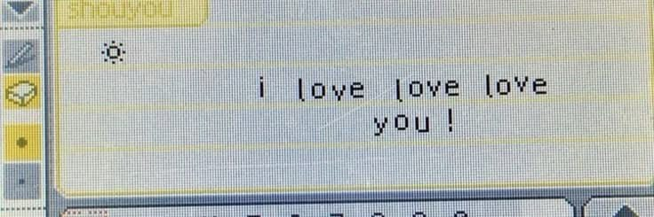

  <h3>Hi, I'm Débora 💝💫</h3>

<h3>🎧 A little about me</h3>

When I'm not studying, you'll probably find me listening to music, watching movies, reading or just discovering something new.

🎵 Music lover
🎬 Movie lover
📚 Reader

🎓 I'm a Technical High School student in Informatics at IFCE, Brazil.

💻 I'm exploring different areas of technology and programming, while figuring out what I enjoy and what I want to pursue in the future.

✨ I enjoy learning new things and working on projects that help me understand more about what I'm studying.

<h2 align="left"> 📖 I have studied</h2>  
 
  <!-- Python -->    
  <!-- MySQL -->  
  <!-- PowerShell -->  

<h2 align="left"> 🌱 Currently learning<h2> 

<!-- JavaScript -->    
<!-- HTML5 -->    
<!-- CSS3 -->    
<!-- Java -->  
